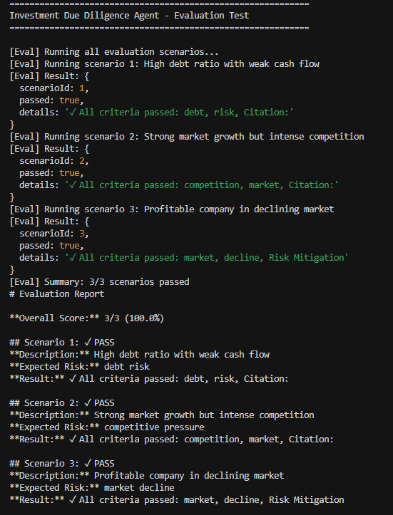

# 🧠 Investment Due Diligence Agent (MVP)

**Multi-Agent RAG System with OpenAI, Pinecone, Next.js 15, Tailwind, MCP & Guardrails**

**Author:** HenryCodeT  
**Date:** October 2025

---

## 🎯 Overview

The **Investment Due Diligence Agent** is an AI-powered system designed to evaluate investment opportunities through multi-agent analysis, combining:

- **Multi-Agent Architecture**: Financial, Market, and Decision agents
- **OpenAI AI SDK** for reasoning and synthesis
- **Pinecone** for RAG (Retrieval-Augmented Generation) and document retrieval
- **MCP Toolkit** for agent control and audit logging
- **Guardrails** for input/output validation and security
- **Evals** for testing and quality assurance

---

## 🚀 Quick Start

### Prerequisites

- Node.js 18+ 
- OpenAI API key
- Pinecone account and API key

### Installation

1. **Clone and install dependencies:**
```bash
cd investment-due-diligence-mvp
npm install
```

2. **Configure environment variables:**
```bash
cp .env.example .env
```

Edit `.env` and add your API keys:
```env
OPENAI_API_KEY=sk-...
PINECONE_API_KEY=...
PINECONE_ENVIRONMENT=us-west1-gcp
PINECONE_INDEX_NAME=investment-due-diligence
```

3. **Set up Pinecone index:**

Create an index in your Pinecone dashboard with:
- **Dimensions**: 3072 (for text-embedding-3-large)
- **Metric**: cosine
- **Name**: investment-due-diligence

4. **Run development server:**
```bash
npm run dev
```

Open [http://localhost:3000](http://localhost:3000)

---

## 📁 Project Structure

```
investment-due-diligence-mvp/
├── src/
│   ├── app/                    # Next.js 15 app directory
│   │   ├── api/
│   │   │   └── analyze/        # Analysis API endpoint
│   │   ├── analyze/            # Results page
│   │   ├── page.tsx            # Home page
│   │   ├── layout.tsx          # Root layout
│   │   └── globals.css         # Tailwind styles
│   ├── components/             # React components
│   │   ├── Button.tsx
│   │   └── FileUploader.tsx
│   ├── lib/                    # Core libraries
│   │   ├── agents/             # Agent implementations
│   │   │   ├── financialAgent.ts
│   │   │   ├── marketAgent.ts
│   │   │   └── decisionAgent.ts
│   │   ├── openai.ts           # OpenAI utilities
│   │   ├── pinecone.ts         # Pinecone utilities
│   │   ├── mcp.ts              # MCP Toolkit
│   │   ├── guardrails.ts       # Input/output validation
│   │   └── evals.ts            # Evaluation framework
│   ├── types/
│   │   └── agent.d.ts          # TypeScript types
│   ├── data/
│   │   └── evals.json          # Evaluation scenarios
│   └── tests/
│       └── runEvals.ts         # Test runner
├── package.json
├── tsconfig.json
├── tailwind.config.js
└── next.config.js
```

---

## 🏗️ Architecture

### Multi-Agent System

```
User Query + Documents
         ↓
   [Input Guardrail]
         ↓
   [MCP Orchestrator]
    ↙          ↘
Financial    Market
  Agent       Agent
    ↘          ↙
   [Decision Agent]
         ↓
  [Output Guardrail]
         ↓
   Due Diligence Report
```

### Agent Responsibilities

1. **Financial Agent**
   - Analyzes financial documents
   - Extracts EBITDA, debt ratios, cash flow
   - Identifies financial risks
   - Provides citations

2. **Market Agent**
   - Analyzes business plans and market data
   - Evaluates growth rate, competition, market share
   - Identifies opportunities and threats
   - Provides citations

3. **Decision Agent**
   - Synthesizes financial and market analysis
   - Generates final recommendation (PROCEED/REVIEW/REJECT)
   - Creates risk mitigation strategies
   - Consolidates citations

---

## 🔧 Tech Stack

| Layer          | Technology                        | Purpose                      |
|----------------|-----------------------------------|------------------------------|
| Frontend       | Next.js 15 + Tailwind CSS         | Modern React UI              |
| Backend        | Next.js API Routes + TypeScript   | Agent orchestration          |
| LLM            | OpenAI AI SDK (GPT-4o-mini)       | Multi-agent reasoning        |
| Vector DB      | Pinecone                          | Document retrieval (RAG)     |
| Tooling        | MCP Toolkit                       | Agent control & logging      |
| Guardrails     | Custom validation                 | Security & quality           |
| Testing        | Custom Evals                      | Scenario validation          |

---

## 💻 Usage

### 1. Upload Documents

Upload financial reports, business plans, and related documents (PDF, TXT, DOC, DOCX).

### 2. Enter Query

Ask specific investment questions:
- "Should we invest in Company X?"
- "What are the key risks for this acquisition?"
- "Evaluate the financial health and market position"

### 3. Review Report

The system generates a comprehensive report with:
- **Recommendation**: PROCEED, REVIEW, or REJECT
- **Executive Summary**: Key findings
- **Financial Analysis**: Metrics and risks
- **Market Analysis**: Growth and competition
- **Risk Mitigation**: Actionable strategies
- **Citations**: Source references

### Sample UI Response


The interface displays the complete analysis with color-coded recommendations and structured insights.

---

## 🧪 Testing

Run evaluation tests:

```bash
npm run test:evals
```

This validates that agent outputs include:
- Proper risk identification
- Required citations
- Risk mitigation strategies

### Evaluation Results



The evaluation suite tests multiple scenarios to ensure agent quality and reliability.

---

## 🛡️ Guardrails

### Input Validation
- Query length limits
- Investment context checking
- Input sanitization

### Output Validation
- Required sections (Risk Mitigation, Citations, Recommendation)
- Structure validation
- Sensitive data detection

### Document Validation
- File type restrictions (PDF, TXT, DOC, DOCX)
- Size limits (10MB)
- Content sanitization

---

## 🔍 MCP Toolkit

The Model Context Protocol (MCP) provides:

- **Agent Registration**: Register agents with unique names
- **Invocation Tracking**: Log all agent calls
- **Performance Monitoring**: Track execution time and success rates
- **Error Handling**: Capture and log failures
- **Audit Trail**: Complete execution history

Example usage:
```typescript
import { registerAgent, invokeAgent } from '@/lib/mcp';

// Register
registerAgent('financial', financialAgent);

// Invoke
const result = await invokeAgent('financial', context);

// Get logs
const logs = getAgentLogs('financial');
```

---

## 📊 API Reference

### POST /api/analyze

Analyze investment documents and return due diligence report.

**Request:**
- Content-Type: multipart/form-data
- Body:
  - `files`: File[] (documents to analyze)
  - `query`: string (investment question)

**Response:**
```json
{
  "recommendation": "PROCEED" | "REVIEW" | "REJECT",
  "summary": "Executive summary...",
  "financialAnalysis": {
    "ebitda": 15,
    "debtRatio": 0.7,
    "cashFlow": "strong",
    "profitability": "Analysis...",
    "risks": ["Risk 1", "Risk 2"],
    "citations": [...]
  },
  "marketAnalysis": {
    "growthRate": "10% CAGR",
    "competition": "moderate",
    "marketShare": "12%",
    "opportunities": [...],
    "threats": [...],
    "citations": [...]
  },
  "riskMitigation": [
    {
      "risk": "Debt risk",
      "mitigation": "Strategy...",
      "priority": "HIGH"
    }
  ],
  "citations": [...],
  "timestamp": "2025-10-24T..."
}
```

---

## 🎨 UI Features

- **Drag & Drop**: Easy file upload
- **Real-time Status**: Loading indicators
- **Responsive Design**: Mobile-friendly
- **Color-coded Results**: Visual recommendation badges
- **Export Functionality**: Download reports as JSON
- **Citation Tracking**: Source references for all claims

---

## 🔐 Security

- Input sanitization to prevent injection attacks
- File type and size validation
- API key protection via environment variables
- Rate limiting ready (can be configured)
- Sensitive data detection in outputs

---

## 📈 Scalability Considerations

For production deployment, consider:

1. **Caching**: Implement Redis for RAG results
2. **Queue System**: Use Bull/BullMQ for long-running analysis
3. **Database**: PostgreSQL for storing reports and audit logs
4. **Monitoring**: Add Sentry or similar for error tracking
5. **Rate Limiting**: Protect API endpoints
6. **Authentication**: Add user authentication (NextAuth.js)
7. **Vector DB**: Scale Pinecone or consider alternatives (Weaviate, Qdrant)

---

## 🚢 Deployment

### Vercel (Recommended)

1. Push code to GitHub
2. Import project in Vercel
3. Add environment variables
4. Deploy

### Docker

```bash
docker build -t investment-dd-agent .
docker run -p 3000:3000 investment-dd-agent
```

---

## 🤝 Contributing

This is an MVP project. For production use, consider:

- Adding unit tests (Jest, React Testing Library)
- Implementing proper error boundaries
- Adding analytics and monitoring
- Creating comprehensive documentation
- Setting up CI/CD pipelines

---

## 📝 License

MIT License - See LICENSE file for details

---

## 👨‍💻 Author

**HenryCodeT**  
Investment Due Diligence Agent MVP  
© 2025

---

## 🙏 Acknowledgments

- OpenAI for GPT models and AI SDK
- Pinecone for vector database
- Next.js team for the framework
- Tailwind CSS for styling utilities

---

## 📚 Resources

- [OpenAI API Documentation](https://platform.openai.com/docs)
- [Pinecone Documentation](https://docs.pinecone.io)
- [Next.js 15 Documentation](https://nextjs.org/docs)
- [Tailwind CSS Documentation](https://tailwindcss.com/docs)

---

**Built with ❤️ for better investment decisions**
